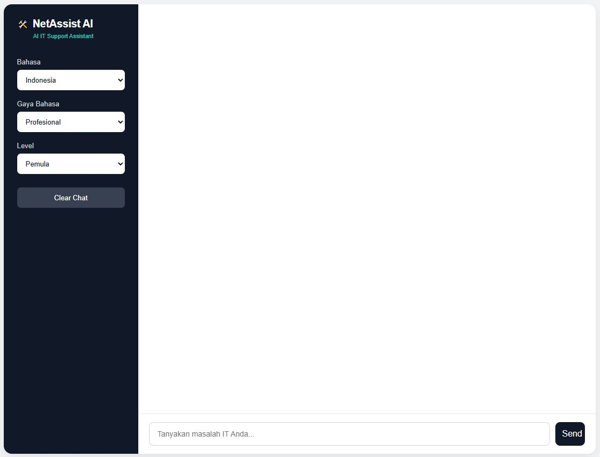
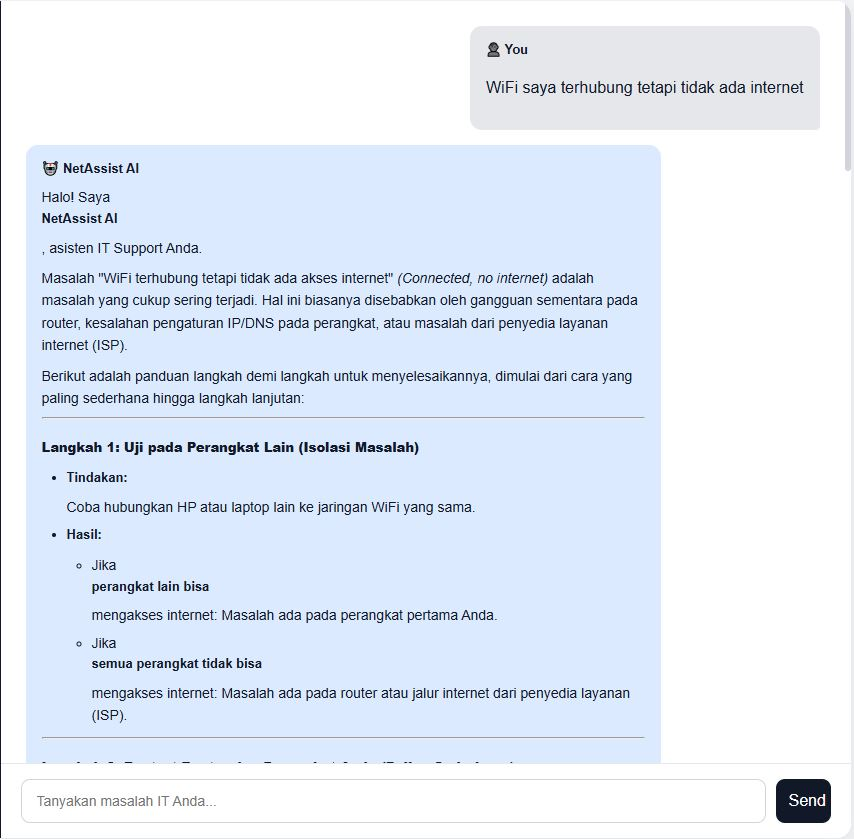
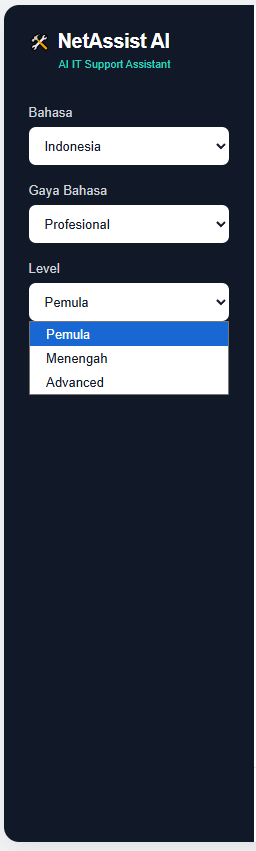
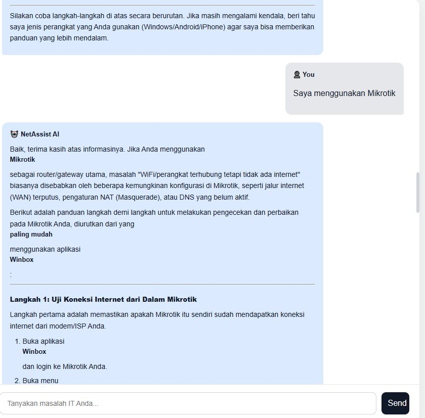

# 🛠️ NetAssist AI

AI-powered IT Support Chatbot using Gemini LLM.

## 📌 Use Case

NetAssist AI is an AI chatbot designed to help
users troubleshoot computer and networking problems.

## 🚀 Features

- Gemini LLM
- Natural Language Processing
- IT Support Assistant
- Networking Troubleshooting
- Conversation Memory
- Multiple User Levels
- Configurable Language
- Configurable Response Style
- Vanilla JavaScript Frontend
- Node.js + Express Backend

## 🧠 AI Configuration

Model: Gemini

Domain: IT Support

Language: Indonesian

Style: Professional

Memory: Enabled

## 🏗️ Architecture

Frontend:
Vanilla JavaScript

Backend:
Node.js + Express

AI:
Google Gemini

## 📂 Project Structure

netassist-ai/
├── public/
│   ├── index.html
│   ├── style.css
│   └── app.js
├── server.js
├── package.json
├── .env
├── .gitignore
└── README.md

## ▶️ Run

npm install

Create .env:

GEMINI_API_KEY=YOUR_API_KEY

Run:

npm run dev

Open:

http://localhost:3000

## 📸 Screenshots

## 👨‍💻 Author

Kristian Dwicandra
